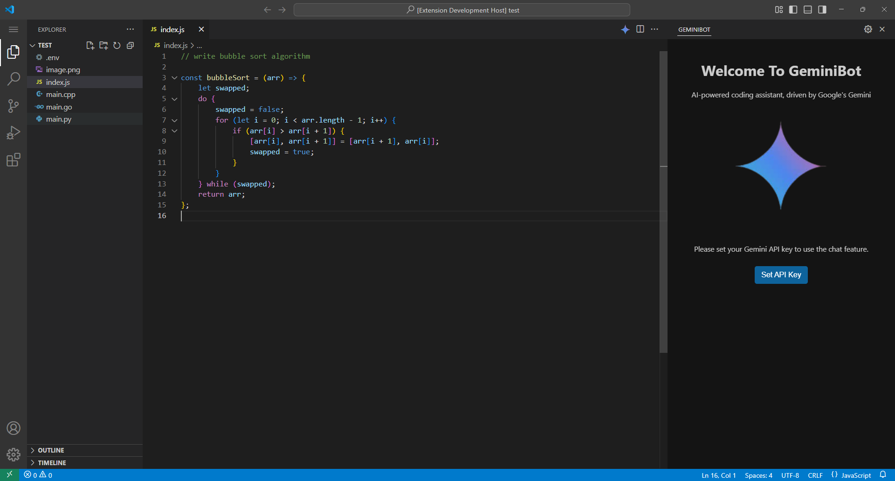
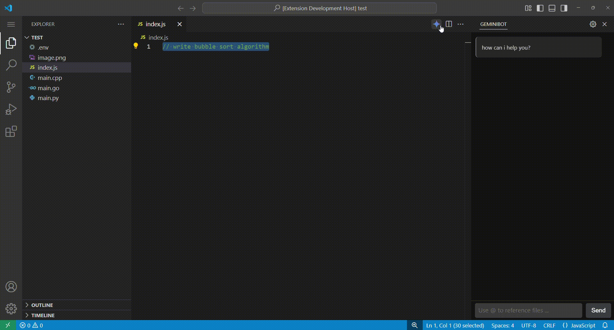
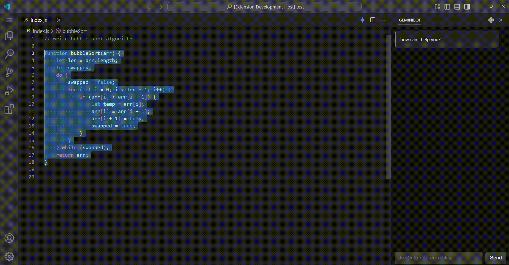
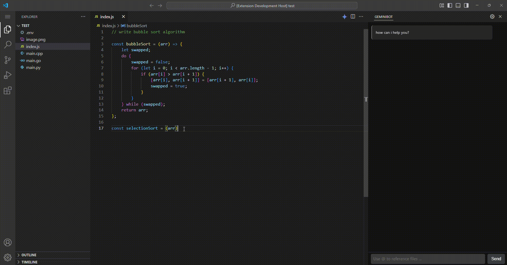

# 🚀 GEMINI BOT
A VScode Extension for coding assistance powered by Google's Gemini.

## ✨ Features

- Chat Panel with File Referencing: Get AI-powered assistance while coding.
- Gemini Bot Shortcut Commands: Quickly execute commands like 
    - Explain Code (`Ctrl+Shift+E`), 
    - Generate Code (`Ctrl+Shift+G`), 
    - Refactor Code (`Ctrl+Shift+R`).
- API Key Management: Easily set and remove your Gemini API key.
- Automatic code completion: Enhance your coding efficiency with AI-powered suggestions.
- Configure settings: switch between different `Gemini models` and adjust parameters like `temperature`, `top_k` and `top_p`

## 🛠️ Installation

1. Open Visual Studio Code.
2. Navigate to the Extensions view by clicking on the Extensions icon in the Activity Bar on the side of the window or by pressing `Ctrl+Shift+X`.
3. Search for "GeminiBOT" in the search bar.
4. Click on the "Install" button for the GeminiBOT extension.

## 🚀 Usage

To use GeminiBOT, you must first set your API key. To do this, click on the Gemini icon in the Activity Bar on the side of the window command palette, then press on **Set API Key** to set you Gemini API key (safely and securely).

Once your API key is set, you can start using the features...

## 🎬 Feature Previews

### Setup Configurations and Chat Bot 
The chatbot can cache previous interactions, ensuring continuity in conversations. It also supports file referencing using `@`, allowing you to ask questions about specific files.

### Code Generation
Simply select a piece of code or a comment and press `Ctrl+Shift+G`, and Gemini Bot will generate relevant code based on the file's programming language. The generated code appears in a UI similar to GitHub's commit interface, allowing you to accept or revert changes with ease.

### Explain Code
Select a block of code and press `Ctrl+Shift+E` to open a dedicated webview panel that presents a well-organized breakdown of the selected code.

### Refactor Code
Select a block of code and press `Ctrl+Shift+R` to initiate the refactoring process. A GitHub commit-style UI appears, allowing you to review the proposed changes and either accept or reject them seamlessly.

### Auto Completion
Gemini Bot provides ghosted inline suggestions by analyzing a few preceding lines of code. Press `Tab` to accept the suggestion and seamlessly integrate it into your code.

## License

This extension is licensed under the [MIT License](LICENSE.txt).
